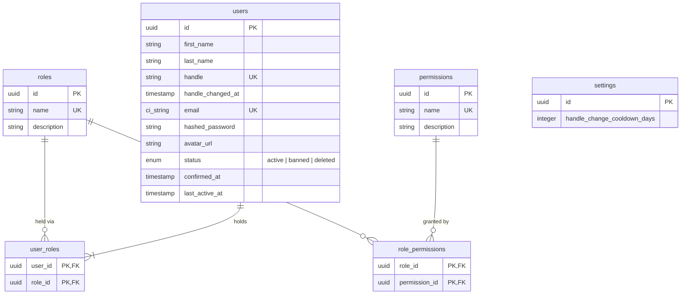

`user_roles` is a many-to-many join, but v1 constrains every user to exactly one role row — enforced at the application/policy layer, not the schema — seeded with `trader` (default, buy + sell) and `admin` (platform staff). `permissions` and `role_permissions` are data-driven so new roles or grants don't require a schema change.

`hashed_password` is nilable, matching `ash_authentication`'s password strategy — accounts created via a future OAuth2-only strategy would have no password set. `status` gates authentication and actions independent of role.

`handle` is silently generated on create (`Mercato.Accounts.User.Changes.GenerateHandle`) — slugified `first_name`+`last_name`, falling back to the email's local part, then the literal `"user"`, suffixed `_1`, `_2`, ... on collision — never a sign-up form field. It's user-editable afterward via the `update_handle` action, gated by a reserved-word blocklist, a `[a-z0-9_]{3,30}` format constraint, and a cooldown since `handle_changed_at` (`nil` until the first manual edit, so that edit is never rate-limited). The cooldown's length is read from the single `settings` row (`handle_change_cooldown_days`, default 30 if no row exists yet) rather than hardcoded, so it's editable without a deploy — reachable via seed/`iex`.

`avatar_url` is set by the `update_avatar` action, which stores the uploaded bytes through the `:storage_adapter` port (`Mercato.Ports.Storage`, see [ports.md](../../architecture/ports.md)) under `avatars/<user_id>/<uuid>-<filename>` and stamps the adapter's returned URL.
